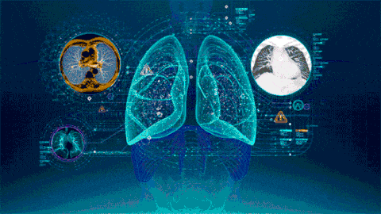
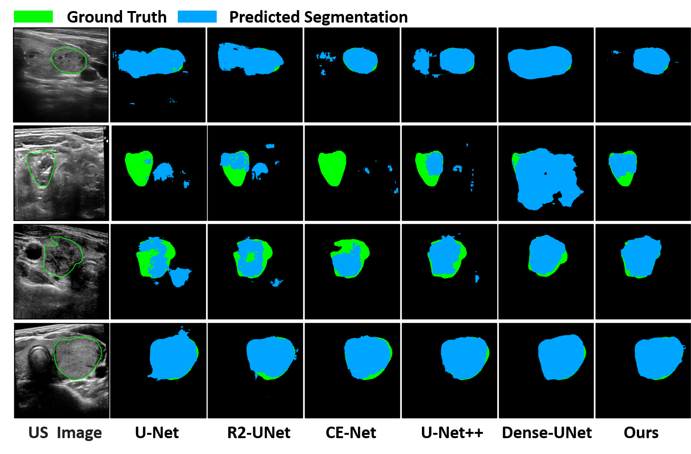
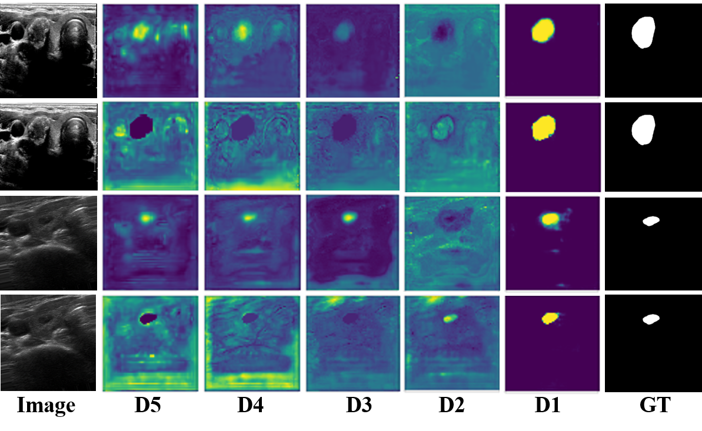

# EANet: Iterative Edge Attention Network for Medical Image Segmentation 
[](https://github.com/sindresorhus/awesome)
[](https://opensource.org/licenses/MIT) [](http://makeapullrequest.com)

<!-- TOC -->
> **Authors:** 
> Kun Wang,
> Xiaohong Zhang,
> Xiangbo Zhang,
> Yuting Lu,
> Sheng Huang,
>  Dan Yang
<!-- 
 -->
## 0. Preface
- [2021/04/22]:**Submitted to the journal of " Pattern Recognition " （Under Review）**
- [2021/08/27]: **(PR2021 Major Revision)**
- [2021/12/20]: **(PR2021 Minor Revision)**
- [2022/3/7]: **(PR2021 Accept)**
### 1.1. 🔥NEWS🔥 :
- [2021/04/22]:fire: Release the inference code!
- [2021/04/20] Create repository.
## Video Demo
 

## Prerequisites
- [Python 3.5](https://www.python.org/)
- [Pytorch 1.3](http://pytorch.org/)
- [OpenCV 4.0](https://opencv.org/)
- [Numpy 1.15](https://numpy.org/)
- [TensorboardX](https://github.com/lanpa/tensorboardX)

## Clone repository
```shell
git clone https://github.com/DLWK/EANet.git
cd EANet/
```
## Download dataset
Download the datasets and unzip them into `data` folder
- [COVID-19](https://medicalsegmentation.com/covid19/)
## Training & Evaluation
```shell
 cd train/
 python3 train.py
```
## Overview
### 1.2. Abstract
Accurate and automatic segmentation of medical images can greatly assist the
clinical diagnosis and analysis. However, it remains a challenging task due to (1)
the diversity of scale in the medical image targets and (2) the complex context
environments of medical images, including ambiguity of structural boundaries,
complexity of shapes, and the heterogeneity of textures. To comprehensively
tackle these challenges, we propose a novel and effective iterative edge attention
network (EANet) for medical image segmentation with steps as follows. First,
we propose a dynamic scale-aware context (DSC) module, which dynamically
adjusts the receptive fields to extract multi-scale contextual information efficiently. Second, an edge-attention preservation (EAP) module is employed to
guide effectively removes noise and helps the edge stream focus on processing
only the boundary-related information. Finally, a multi-level pairwise regression
(MPR) module is designed to combine the complementary edge and region information for refining the ambiguous structure. This iterative optimization helps
to learn better representations and more accurate saliency maps. Extensive experimental results demonstrate that the proposed network achieves superior segmentation performance to state-of-the-art methods in four different challenging medical segmentation tasks, including lung nodule segmentation, COVID-19 infection segmentation, lung segmentation, and
thyroid nodule segmentation.
## Overview framework
<!--   -->
<p align="center">
     <br />
    <em> 
    Figure 1: Overview of the proposed EANet. Our network is in an encoder-decoder style,
it consists of the VGG-19 feature encoder E1 ∼ E5, dynamic scale-aware context (DSC) module, edge attention preservation (EAP) module, the feature decoder
D1 ∼ D5 and multilevel pairwise regression (MPR) module. HFF denotes hybrid feature fusion block, which is
a component of MPR. The final prediction is the generated global map (Sg) after iterative
optimization by combining edge information and region information. The Si, {i = 2, 3, 4, 5}
indicates the feature map of the side-output laye.
    </em>
</p>

### 1.3. State-of-the-art Approaches  
1. "CE-Net: Context encoder network for 2d medical image segmentation" TMI, 2019.
doi:https://ieeexplore.ieee.org/abstract/document/8662594/
2. "Recurrent Residual Convolutional Neural Network based on U-Net (R2U-Net) for Medical Image Segmentation" 2018.
doi: https://arxiv.org/abs/1802.06955
3. "Rethinking Atrous Convolution for Semantic Image Segmentation" IEEE TPAMI, 2018
doi: https://arxiv.org/abs/1706.05587
4. "Unet++: A nested u-net architecture for medical image segmentation" IEEE TMI, 2019
doi: https://www.ncbi.nlm.nih.gov/pmc/articles/PMC7329239/
5. "U-Net: Convolutional networks for biomed- ical image segmentation" MICCAI, 2015.
6. "FCN8s：Fully Convolutional Networks for Semantic Segmentation" CVPR, 2015.
doi:https://arxiv.org/abs/1411.4038

### 1.4. Visualization Results
<p align="center">
     <br />
    <em> 
    Figure 2:Visual comparison of COVID-19 infection segmentation results, where the red and
green labels indicate the predicted segmentation and ground truth, respectively.
    </em>
</p>

<p align="center">
     <br />
    <em> 
    Figure 3:The visual comparison of results on the TN-SCUI dataset, where the blue and
green labels indicate the predicted segmentation and ground truth, respectively
    </em>
</p>

<p align="center">
     <br />
    <em> 
    Figure 4:Visual comparison of feature maps for showing the effect of multi-level pairwise
regression module (MPR). D5 ∼ D1 denote the feature maps of each decoder block. The odd
and even rows show the baseline results without or with MPR, respectively.
    </em>
</p>


# Tips
:fire:If you have any questions about our work, please do not hesitate to contact us by emails.


**[⬆ back to top](#0-preface)**
