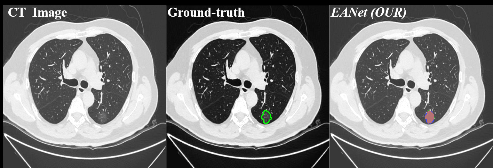
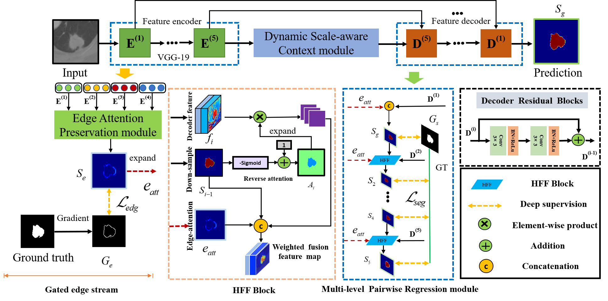
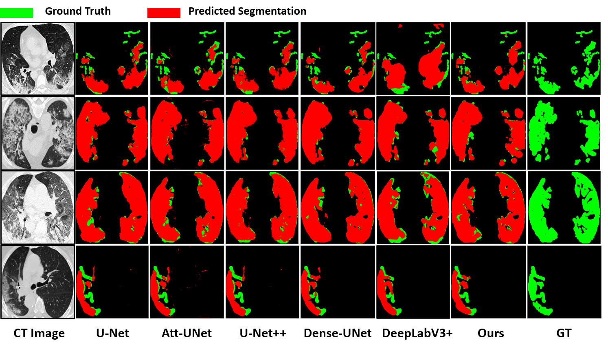

## EANet:Iterative Edge Attention Network for Medical Image Segmentation 
by Kun Wang, Xiaohong Zhang, Xiangbo Zhang et al.

## Submitted to the journal of " Pattern Recognition " （Under review）
### 1.1. 🔥NEWS🔥 :
- [2021/04/22] Release the inference code!
- [2021/04/20] Create repository.
## Visualization Demo
 
## EANet framework
 
## Prerequisites
- [Python 3.5](https://www.python.org/)
- [Pytorch 1.3](http://pytorch.org/)
- [OpenCV 4.0](https://opencv.org/)
- [Numpy 1.15](https://numpy.org/)
- [TensorboardX](https://github.com/lanpa/tensorboardX)

## Clone repository
```shell
git clone https://github.com/DLWK/EANet.git
cd EANet/
```
## Download dataset
Download the datasets and unzip them into `data` folder
- [COVID-19](https://medicalsegmentation.com/covid19/)
## Training & Evaluation
```shell
 cd train/
 python3 train.py
```
### 1.2. State-of-the-art Approaches  
1. "CE-Net: Context encoder network for 2d medical image segmentation" TMI, 2019.
doi:https://ieeexplore.ieee.org/abstract/document/8662594/
2. "Recurrent Residual Convolutional Neural Network based on U-Net (R2U-Net) for Medical Image Segmentation" 2018.
doi: https://arxiv.org/abs/1802.06955
3. "Rethinking Atrous Convolution for Semantic Image Segmentation" IEEE TPAMI, 2018
doi: https://arxiv.org/abs/1706.05587
4. "Unet++: A nested u-net architecture for medical image segmentation" IEEE TMI, 2019
doi: https://www.ncbi.nlm.nih.gov/pmc/articles/PMC7329239/
5. "U-Net: Convolutional networks for biomed- ical image segmentation" MICCAI, 2015.
6. "FCN8s：Fully Convolutional Networks for Semantic Segmentation" CVPR, 2015.
doi:https://arxiv.org/abs/1411.4038
## 1.3. Visualization Results
 
# Tips
If you have any questions about our work, please do not hesitate to contact us by emails.


**[⬆ back to top](#0-preface))**
